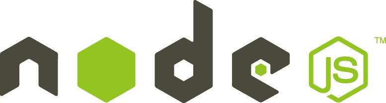
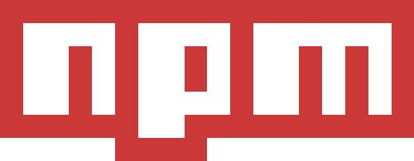
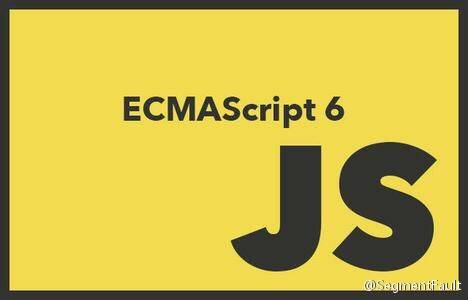

title: vue 前端开发
speaker: willchen
url: https://github.com/chenweiyu/ppt
transition: slide3
files: /js/demo.js,/css/demo.css,/js/zoom.js
theme: moon
usemathjax: yes

[slide data-transition="vertical3d" style="background-image:url('./img/timg.jpg');background-size: 100% 100%;"]
# 发布系统前端技术分享

[slide data-transition="vertical3d"]
# 大纲
* 前端工程化
 * 为什么需要工程化    
 * 工程化演进过程
 * 通过webpack实现前端工程化

* 单页面应用（SPA）
 * 传统开发方式介绍 
 	* SSR（Server-Side-Render）
 	* jQuery  
 * SPA 开发方式介绍
 * SPA 优缺点
 * SPA 适用场景

* SPA框架：Vue
 * Vue 介绍
 * Vue原理解析 (MVVM + Vistual DOM)
 * jQuery 和 Vue 业务实现对比
 * Vue 性能对比
 * Vue 构建应用及其生态
 

[slide data-transition="vertical3d"]
# 为什么需要工程化
随着前端技术的发展，搭建复杂的前端应用不再是简单的html + css + html，而是需要做到更多: 模块化依赖管理，es6 babel编译器，css预编译，代码合并，代码压缩，代码混淆加密，图片压缩，文件缓存管理，热加载
 lint代码检查，mock模拟数据，单元测试，UI自动化测试。

* 开发效率：代码规范，javascript编译，css预处理，模块化管理，数据 mock，热加载...
* 性能优化：
    图片压缩，代码压缩，代码合并
* 代码复用：
    web组件化
这些统称为前端工程化，或者是前端构建自动化

[slide data-transition="vertical3d"]
# 演进过程

* `<script>`混乱加载
* 各种模块化系统标准：commonjs/amd/es6 module
* 模块化加载器：requirejs/seajs/systemjs
* 自动化构建工具：grunt，gulp
* 模块化打包器：webpack/r.js/jspm/browserify
 * 合并入口，对外只暴露entry point
 * 提供浏览器运行环境（内置模块加载器）
 * 优化（代码压缩，混淆加密，tree-shaking无用代码移除）

[slide data-transition="vertical3d"]
# 通过webpack实现前端工程化
* npm（node package manager） 包管理器

[slide data-transition="vertical3d"]
# 单页面应用（SPA）

[slide data-transition="vertical3d"]
# 传统开发方式 

	* 前后端耦合
	* 前后端沟通成本高

# jQuery 时代

jQuery的出现给早期的前端领域注入了一剂强心剂，前端工程狮们不再需要投入大量的精力去解决那些令人蛋疼的浏览器兼容问题，从而减少了项目跨浏览器兼容的工作量。
<!-- jquery 2006 ; es5 2009 ; es6 2015; es8 2017 -->
<!-- jQuery的劣势也非常明显，因为需要各种兼容所以代码显得特别重 -->
<!-- 另外就是全DOM操作，钩子往往会依赖标签，如果依赖jQuery来搭建页面的话（比如后台输出json，然后jQuery loop一个列表出来），维护上会有困难。如果一改页面结构，很多依赖标签的选择器，一改起来js那块就得跟着大改，代码维护成本高。
频繁操作dom 元素，性能问题。
 -->

[slide data-transition="vertical3d"]
# SPA 开发方式

[slide data-transition="vertical3d"]
# SPA 优缺点
* 特点：
	* 后端服务化。良好的前后端分离，前端负责界面显示，后端负责数据存储和计算，不再负责模板渲染、输出页面工作。
	* 减轻服务器压力。服务器只用出数据就可以，不用管展示逻辑和页面合成，提高服务器吞吐能力。
	* 用户体验好、快，内容的改变不需要重新加载整个页面。

* 缺点：
	* 不利于SEO。

[slide data-transition="vertical3d"]
# SPA 适用场景

[slide data-transition="vertical3d"]
# SPA框架：Vue

[slide data-transition="vertical3d"]
# Vue 介绍
数据驱动

[slide data-transition="vertical3d"]
# Vue原理解析 (MVVM + Vistual DOM)

[slide data-transition="vertical3d"]
# jQuery 和 Vue 业务实现对比
1. 便捷（table 比较）
2. 高度可复用（新建，修改页面 复用一套）

[slide data-transition="vertical3d"]
# Vue 性能对比
* angular (脏检查)
* vue (数据劫持)
* react (View层)

[slide data-transition="vertical3d"]
# Vue 构建应用及其生态

 

 
    

 

 

 

